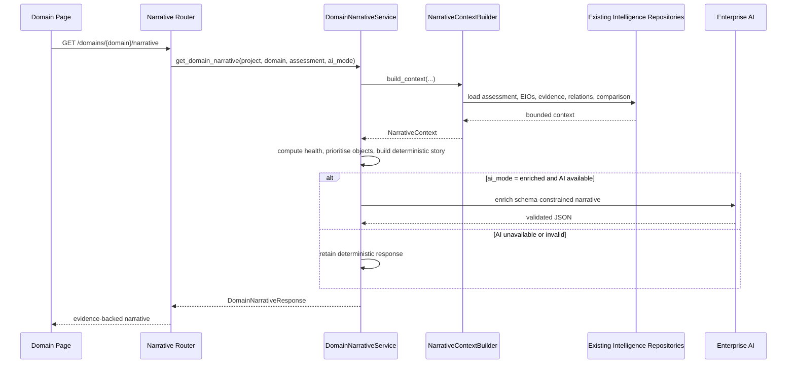
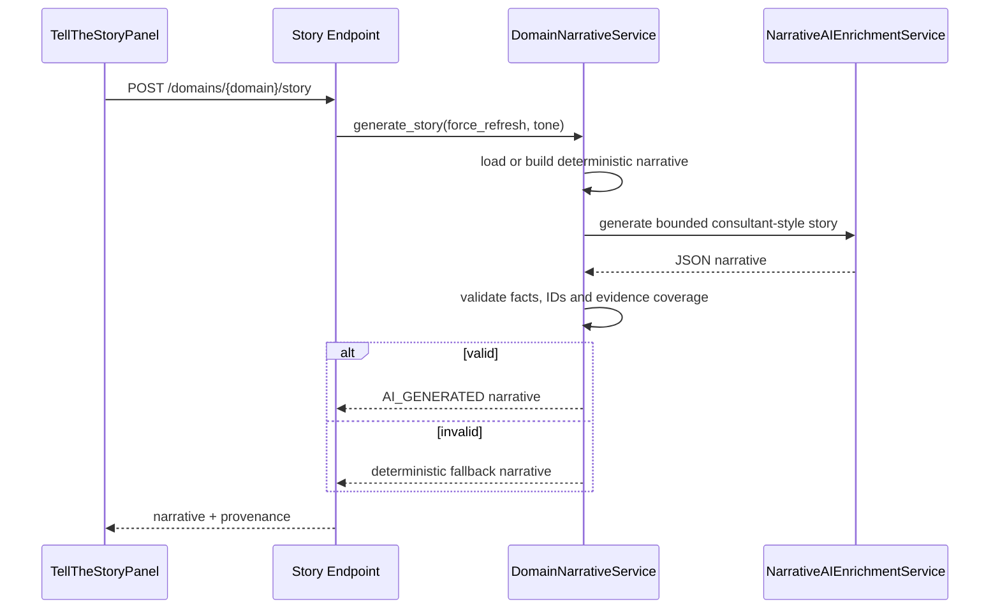
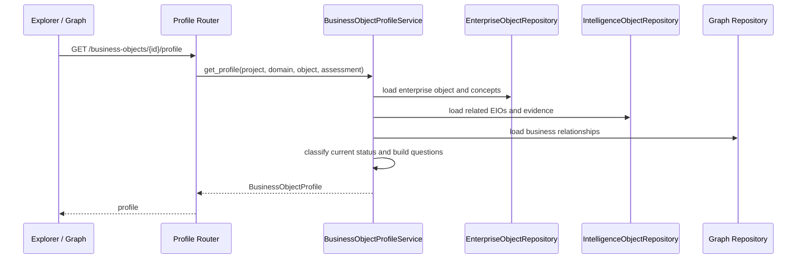
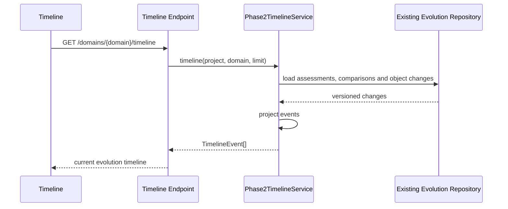

# Sequence Flows

## Domain narrative read

```mermaid
sequenceDiagram
    participant UI as Domain Page
    participant API as Narrative Router
    participant SVC as DomainNarrativeService
    participant CTX as NarrativeContextBuilder
    participant REPO as Existing Intelligence Repositories
    participant AI as Enterprise AI

    UI->>API: GET /domains/{domain}/narrative
    API->>SVC: get_domain_narrative(project, domain, assessment, ai_mode)
    SVC->>CTX: build_context(...)
    CTX->>REPO: load assessment, EIOs, evidence, relations, comparison
    REPO-->>CTX: bounded context
    CTX-->>SVC: NarrativeContext
    SVC->>SVC: compute health, prioritise objects, build deterministic story
    alt ai_mode = enriched and AI available
        SVC->>AI: enrich schema-constrained narrative
        AI-->>SVC: validated JSON
    else AI unavailable or invalid
        SVC->>SVC: retain deterministic response
    end
    SVC-->>API: DomainNarrativeResponse
    API-->>UI: evidence-backed narrative
```

## Tell me the story

```mermaid
sequenceDiagram
    participant UI as TellTheStoryPanel
    participant API as Story Endpoint
    participant SVC as DomainNarrativeService
    participant AI as NarrativeAIEnrichmentService

    UI->>API: POST /domains/{domain}/story
    API->>SVC: generate_story(force_refresh, tone)
    SVC->>SVC: load or build deterministic narrative
    SVC->>AI: generate bounded consultant-style story
    AI-->>SVC: JSON narrative
    SVC->>SVC: validate facts, IDs and evidence coverage
    alt valid
        SVC-->>API: AI_GENERATED narrative
    else invalid
        SVC-->>API: deterministic fallback narrative
    end
    API-->>UI: narrative + provenance
```

## Business Object Profile

```mermaid
sequenceDiagram
    participant UI as Explorer / Graph
    participant API as Profile Router
    participant SVC as BusinessObjectProfileService
    participant EOR as EnterpriseObjectRepository
    participant IOR as IntelligenceObjectRepository
    participant GR as Graph Repository

    UI->>API: GET /business-objects/{id}/profile
    API->>SVC: get_profile(project, domain, object, assessment)
    SVC->>EOR: load enterprise object and concepts
    SVC->>IOR: load related EIOs and evidence
    SVC->>GR: load business relationships
    SVC->>SVC: classify current status and build questions
    SVC-->>API: BusinessObjectProfile
    API-->>UI: profile
```

## Assessment evolution

```mermaid
sequenceDiagram
    participant UI as Timeline
    participant API as Timeline Endpoint
    participant SVC as Phase2TimelineService
    participant EVO as Existing Evolution Repository

    UI->>API: GET /domains/{domain}/timeline
    API->>SVC: timeline(project, domain, limit)
    SVC->>EVO: load assessments, comparisons and object changes
    EVO-->>SVC: versioned changes
    SVC->>SVC: project events
    SVC-->>API: TimelineEvent[]
    API-->>UI: current evolution timeline
```
